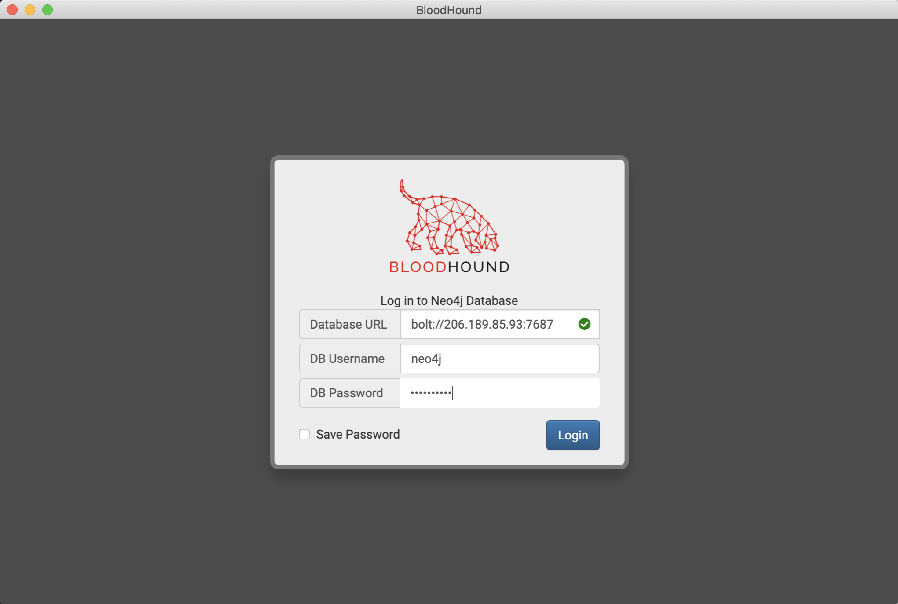
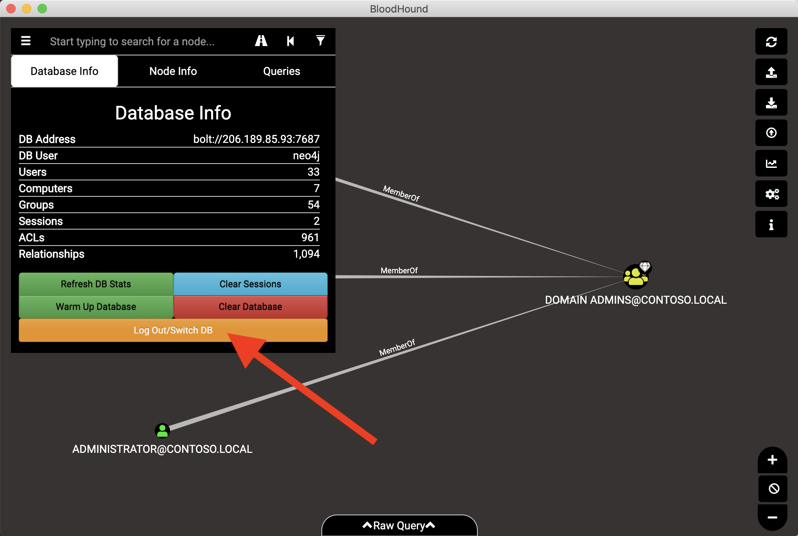
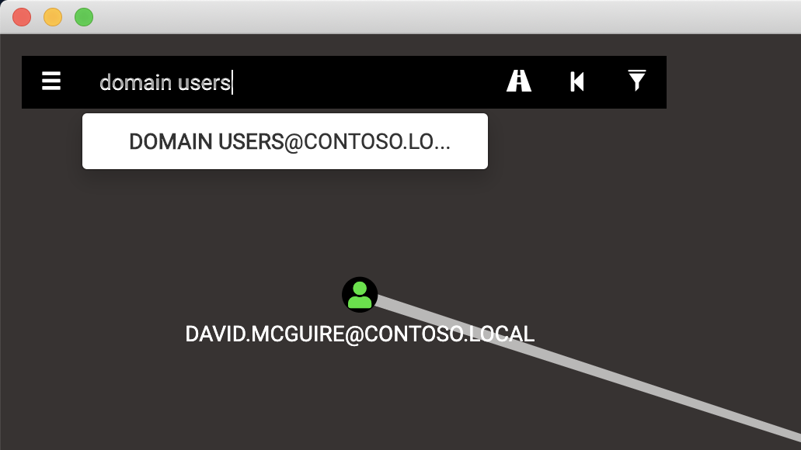
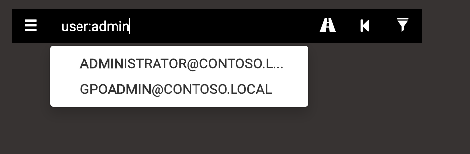
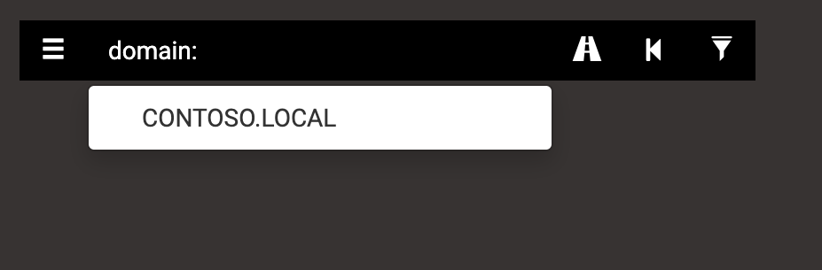
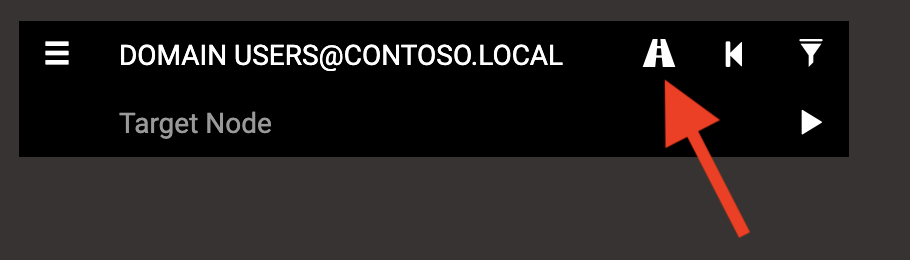
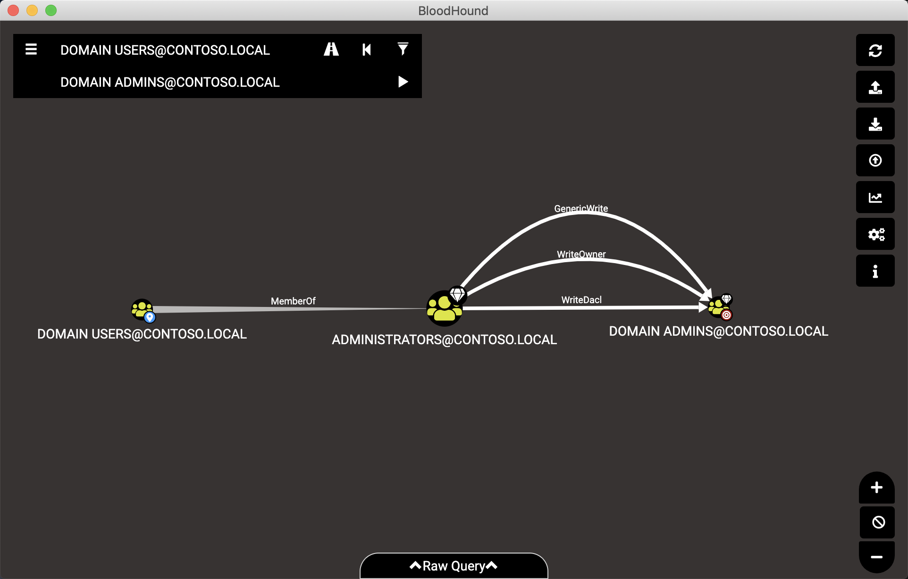
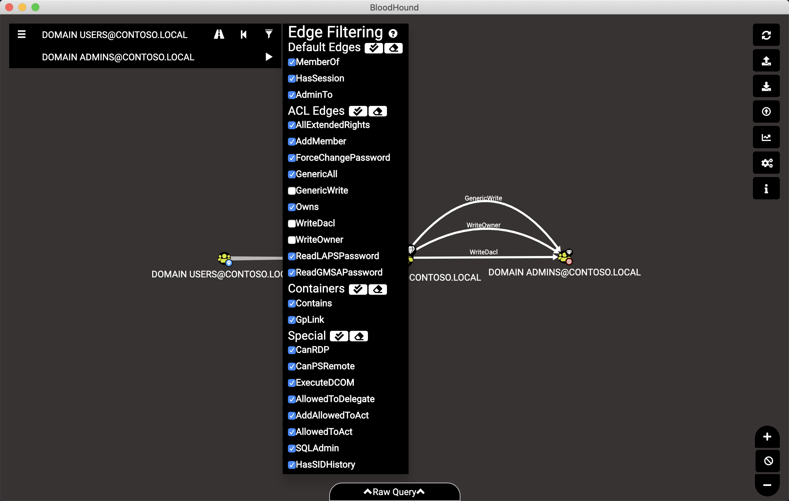
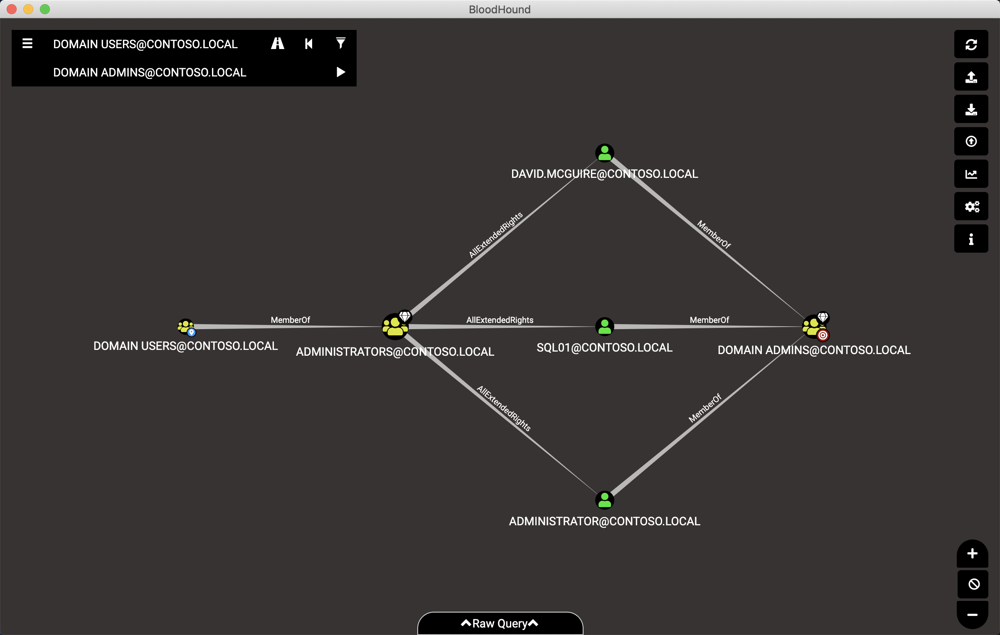
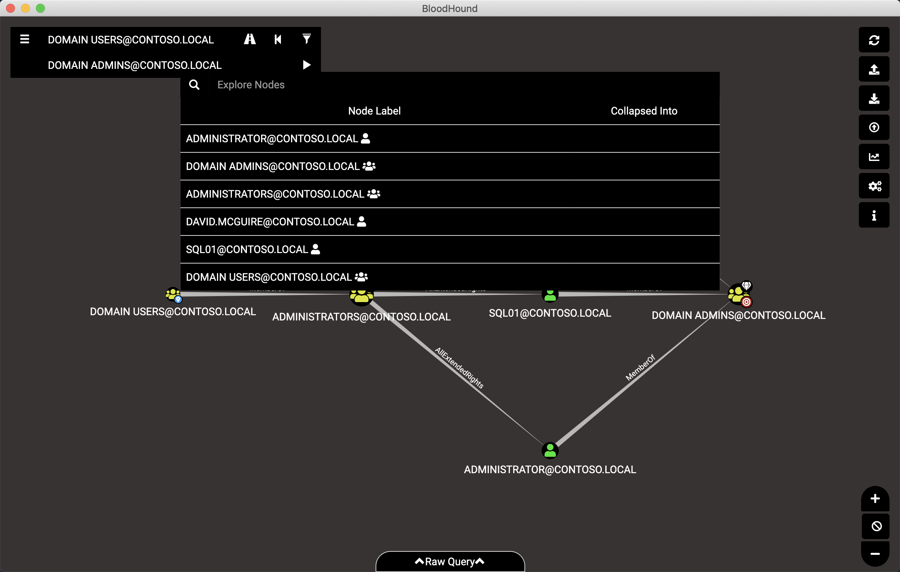

The BloodHound GUI
==================

After setting up neo4j and collecting data with SharpHound, you're
ready to explore the data with the BloodHound GUI.

.. note:: Want to follow along? Explore the example dataset by loading
   the example db locally, or connect to the hosted example dataset at
   bolt://206.189.85.93:7687

Connecting to your Database
^^^^^^^^^^^^^^^^^^^^^^^^

When you open BloodHound for the first time, you will be prompted to
log into a neo4j database:

Enter the IP address of your neo4j server (or localhost if neo4j is running
locally), the neo4j user name, and neo4j password.

.. note:: Following along with the example database? The username is neo4j
   and the password is BloodHound. The online example is hosted at
   bolt://206.189.85.93:7687

You can optionally check the box next to "Save Password". This will store
your neo4j credentials on disk, and BloodHound will automatically try to
authenticate to neo4j with that info the next time you open the GUI.

Credentials are saved on disk in the following locations:

* **Windows**: %APPDATA%
* **Linux**: $XDG_CONFIG_HOME or ~/.config
* **OSX**: ~/Library/Application Support

After authenticating, you'll be presented with the standard GUI, including
the graph rendering area, search bar, etc. If you want to connect to a different
neo4j instance, you can disconnect from your current instance by clicking
the "Database Info" tab, then clicking "Log Out/Switch DB":

Importing Data
^^^^^^^^^^^^^^

When SharpHound finishes collecting data, it will create a ZIP file which
contains individual JSON files. The easiest way to import that data is to
very simply drag and drop the ZIP into the BloodHound GUI:

.. image:: ../images/import-data.gif
   :align: center
   :width: 700px
   :alt: Import data with drag and drop

When finished, you'll see an alert at the top that says "Finished processing
all files"

You can also import the individual JSON files one at a time, and even import
multiple zip files at the same time.

The data import process is almost exclusively using `merge` operations, meaning
if the data you're importing is already in the database, there will be no change.
For example, if BloodHound already knows a certain user belongs to a group,
and you re-import group membership data, there won't be any change: BloodHound
will simply keep the same information it had before.

The data import process will also never `remove` data from the database: if a
user belonged to a group, then no longer does after a new data collection, the
data import process will not remove the data - you'll still see the user as a
part of that group.

Some data will be over-written, such as properties on objects. For example, if
a user's last logon time stamp is updated in AD, the data import process will
update that property on the user node.

Searching for Nodes
^^^^^^^^^^^^^^^^^^^

Use the search bar in the upper left to find nodes. When you start typing,
BloodHound will search for nodes that match what you've currently typed and
recommend matching nodes in a dropdown:

You can hit enter to show all nodes whose name matches your current search, or
click one of the auto-recommended entries to render just that one node.

You can also constrain your search to a particular type of node. This can help
with finding nodes faster or in particular with finding domain head nodes. You
can prepend your search with any of the following to constrain your search to
nodes of that type:

* `group:` search only for AD security groups
* `user:` search only for AD users
* `computer:` search only for computer objects
* `domain:` search only for domain head nodes
* `gpo:` search only for group policy objects
* `ou:` search only for organizational unit nodes

For example, to search just for user objects that have the word "admin" in them:

Or to search for any `domain` head type node:

Path Finding
^^^^^^^^^^^^

Probably the most exciting feature of a graph is its ability to find paths
from one node to another, if a path exists. When you use Google maps to find
a route, that's actually being powered by a graph as well.

To find a path between two nodes in the BloodHound GUI, click the path finding
button, which looks like a highway. When you click that button, a second search
bar will appear below the primary search bar:

This second search bar works the same way as the top one: just start typing
and BloodHound will recommend nodes that match what you've searched for so far.
When you click a node that matches, BloodHound will query the database and if
there is one or more shortest path between those nodes, the GUI will render those
paths:

As a red teamer, you may not want to execute some or all of the attacks BloodHound
is presenting you. Use the edge filtering button to select which particular edges
you want BloodHound to include. Any edges that are not checked will be filtered out,
and you'll only see attack paths that include edges you have selected.

.. note::
   "Edge" is a graph term, meaning the relationship that connects one node to
   another.

For example, if we don't want to execute the attacks associated with the "WriteOwner",
"GenericWrite" and "WriteDacl" edges, we can de-select those in the edge filtering
pop-out:

Now, click the "play" button to re-run the path finding query, this time without
those particular edges selected. If there are any paths, BloodHound will show them:

Keyboard Commands
^^^^^^^^^^^^^^^^^

Space bar
---------

Pressing space bar will bring up the spotlight, which lists all nodes currently
drawn in the GUI:

Click a node listed in the spotlight to zoom in and briefly
highlight that node:

.. image:: ../images/spotlight-click-node.gif
   :align: center
   :widt

At the bottom of the BloodHound GUI is the Raw Query bar. Click where it says "^Raw
Query^", and the input box will appear. In this box you can insert and execute cypher
queries. The BloodHound GUI will render the results of that query.

.. note::h: 700px
   :alt: Highlight node

Control
-------

Pressing the left CTRL key will cycle the GUI through the three node label display
settings:

* Threshold display: Default, let the GUI decide which labels to show and which to hide
* Always display
* Never display

.. image:: ../images/node-label-display-cycle.gif
   :align: center
   :width: 700px
   :alt: Node display settings

This feature can especially help when creating screenshots from the BloodHound GUI for
your red team and pentest reports

F12 / CTRL+SHIFT+I
------------------

Press F12 on Windows (or CTRL+SHIFT+I in OSX or Linux) will bring up the Chromium developer
tools tab. Click the "console" tab in the developer tools, and you can see any Javascript
errors here. This can really help out with troubleshooting issues in the BloodHound GUI.

Raw Queries Bar
^^^^^^^^^^^^^^^

Running raw queries
-------------------

At the bottom of the BloodHound GUI is the Raw Query bar. Click where it says "^Raw
Query^", and the input box will appear. In this box you can insert and execute cypher
queries. The BloodHound GUI will render the results of that query.

.. note:: Your query must return either nodes or paths. The BloodHound GUI cannot
   render list output

Try it out yourself with a very simple query:

::

   MATCH (n) RETURN n LIMIT 5

This will match any node and assign it to variable `n`, then return nodes, limiting
to just the first 5 nodes that come back. Type out or copy and paste that query into
the Raw Query text box and hit enter:

.. image:: ../images/raw-query.gif
   :align: center
   :width: 700px
   :alt: Raw query input, execution, and display

When you're ready to start learning cypher, check out the Intro to Cypher page.

Query debug mode
----------------

Enable "Query Debug Mode" in the settings modal, and then any time the BloodHound GUI
executes a cypher query, the query as submitted to neo4j will be shown in the raw query
bar. This can be a good way to learn cypher by executing built-in queries in the BH GUI,
then copy and pasting them into a text editor for study.
